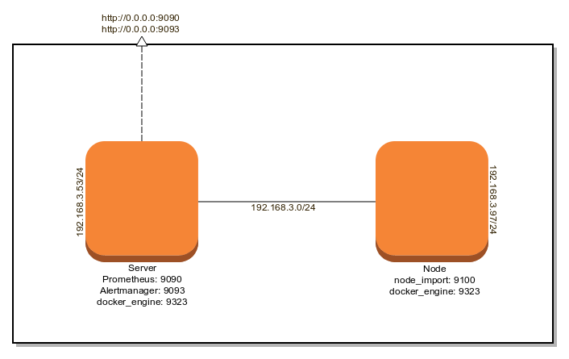
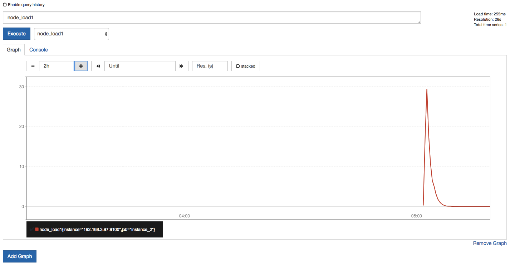
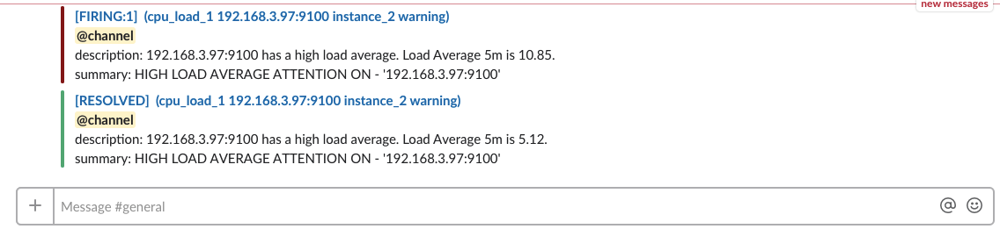
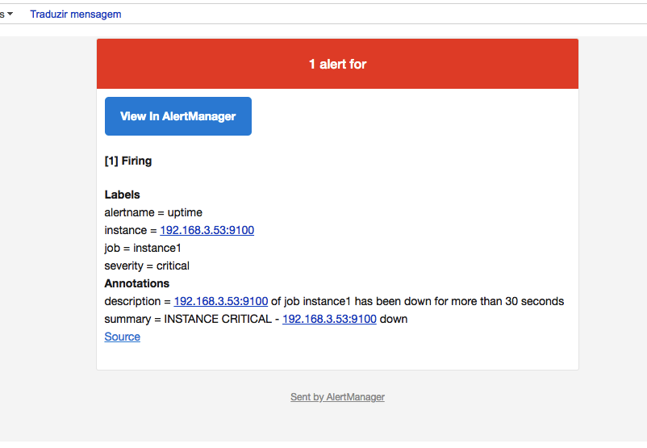
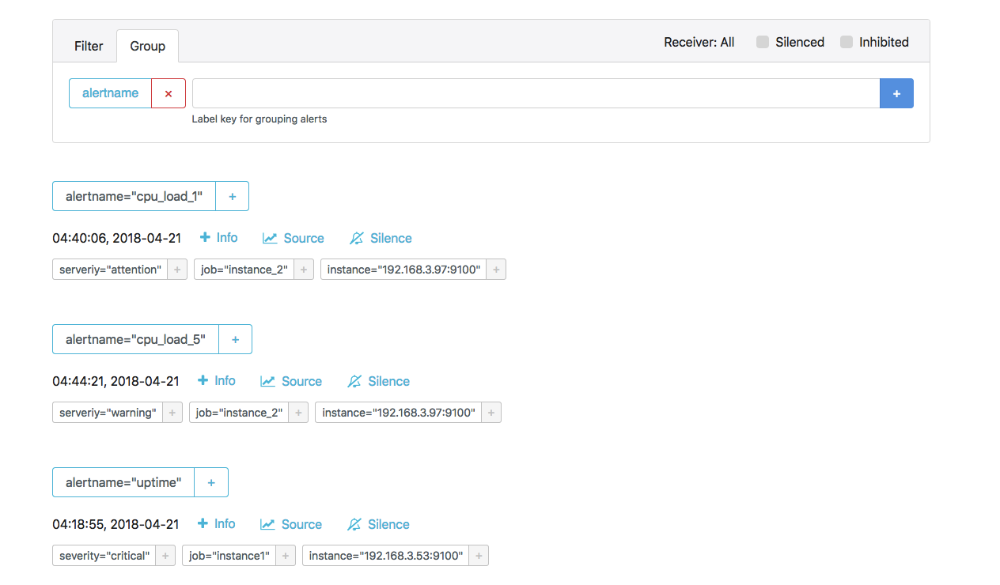

# Resumo teórico:

* [Primeiros passos](https://github.com/vandocouto/Docker-Prometheus-V2.2.1/blob/master/pages/Prometheus-Basic.md)
* [Conceitos Básicos](https://github.com/vandocouto/Docker-Prometheus-V2.2.1/blob/master/pages/Prometheus-Conceito.md)
* [Configuração](https://github.com/vandocouto/Docker-Prometheus-V2.2.1/blob/master/pages/Prometheus-Configura%C3%A7%C3%A3o.md)
* [Armazenamento (Storage)](https://github.com/vandocouto/Docker-Prometheus-V2.2.1/blob/master/pages/Prometheus-Armazenamento.md)
* [Alertas](https://github.com/vandocouto/Docker-Prometheus-V2.2.1/blob/master/pages/Prometheus-Alert.md)

# Construindo o servidor Prometheus:




* Necessário que tenha conhecimento básicos de Docker Engine e Docker Compose.

Baixando o projeto:
```bash
git clone https://github.com/vandocouto/Docker-Prometheus-V2.2.1.git
cd Docker-Prometheus-V2.2.1
```
Construindo as imagens:
```bash
docker build -f build-prometheus/Dockerfile -t prometheus:latest .
docker build -f build-alertmanager/Dockerfile -t alertmanager:latest .
```
Criando o volume (storage)
```bash
docker volume create --name=prometheus
```
Levantando os containers:
```bash
docker-compose up -d
```

### Estrutura

```bash
├── build-alertmanager
│   ├── alertmanager.yml
│   ├── default.tmpl
│   ├── Dockerfile
│   ├── email.html
│   └── run.sh
├── build-prometheus
│   ├── alert.rules
│   ├── Dockerfile
│   └── prometheus.yml
├── docker-compose.yml
├── environment.env
└── README.md
```


### Gráficos

**Gráfico CPU LOAD**



### Alertas

**Alerta recebido no canal General do Slack**



**Alerta recebido no email (Relay configurado para o prometheus)**



**Alerta recebido no http://alertmanager:9093**



Fonte: https://prometheus.io/docs/alerting/clients/
